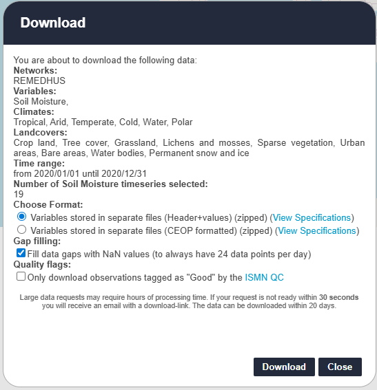
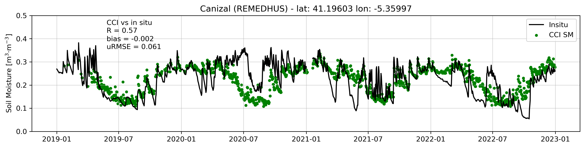

# About the project

This project provides tools to process, analyze, and visualize soil moisture (SM) data from the International Soil Moisture Network (ISMN) network. 
It allows [batch reading](notebooks/process_ismn_soil_moisture.ipynb) of multiple files, filtering by date and quality flags, 
and averaging measurements when needed. The processed data are saved for later use.

The repository also includes scripts to [generate time series](notebooks/plot_ismn_timeseries_stats.ipynb) plots of soil moisture at selected stations, 
compute statistics such as correlation, bias, and uRMSE, and optionally compare the in situ data with 
satellite-derived soil moisture from ESA Climate Change Initiative.

Key features:
- Batch processing of ISMN soil moisture data.
- Filtering by date and quality flags.
- Generation of daily-averaged time series.
- Calculation of key statistics for in situ vs satellite comparison.
- Visualization of time series and statistics for multiple stations.

The notebooks are organized as follows:

* [process_ismn_soil_moisture.ipynb](notebooks/process_ismn_soil_moisture.ipynb): Reads, filters, and processes multiple ISMN files, computes daily averages, and saves the data along with station metadata.
* [plot_ismn_timeseries_stats.ipynb](notebooks/plot_ismn_timeseries_stats.ipynb): Loads the processed data, generates time series for ISMN (and optionally ESA CCI), computes statistics (correlation, bias, uRMSE), and creates comparative plots.

## Datasets

### ISMN in situ data
The in situ soil moisture data can be downloaded from the [ISMN](https://ismn.earth/en/). 
The data should be downloaded as shown in Figure 1.

*Figure 1: Selected options for downloading ISMN soil moisture [data](https://ismn.earth/en/).*

### ESA CCI Soil Moisture
ESA CCI soil moisture data are used to plot time series together with the in situ SM and to compute statistics between them. 
The CCI SM v8.01 dataset can be downloaded from [here](https://catalogue.ceda.ac.uk/uuid/ff890589c21f4033803aa550f52c980c/).

## Example

After processing the ISMN soil moisture data and generating the time series plots, the following example output is obtained for a selected station:

*Figure 2: Example time series of soil moisture for an ISMN station (black: in situ, green: ESA CCI). Key statistics are shown on the plot: correlation (R), bias, and uRMSE.*
